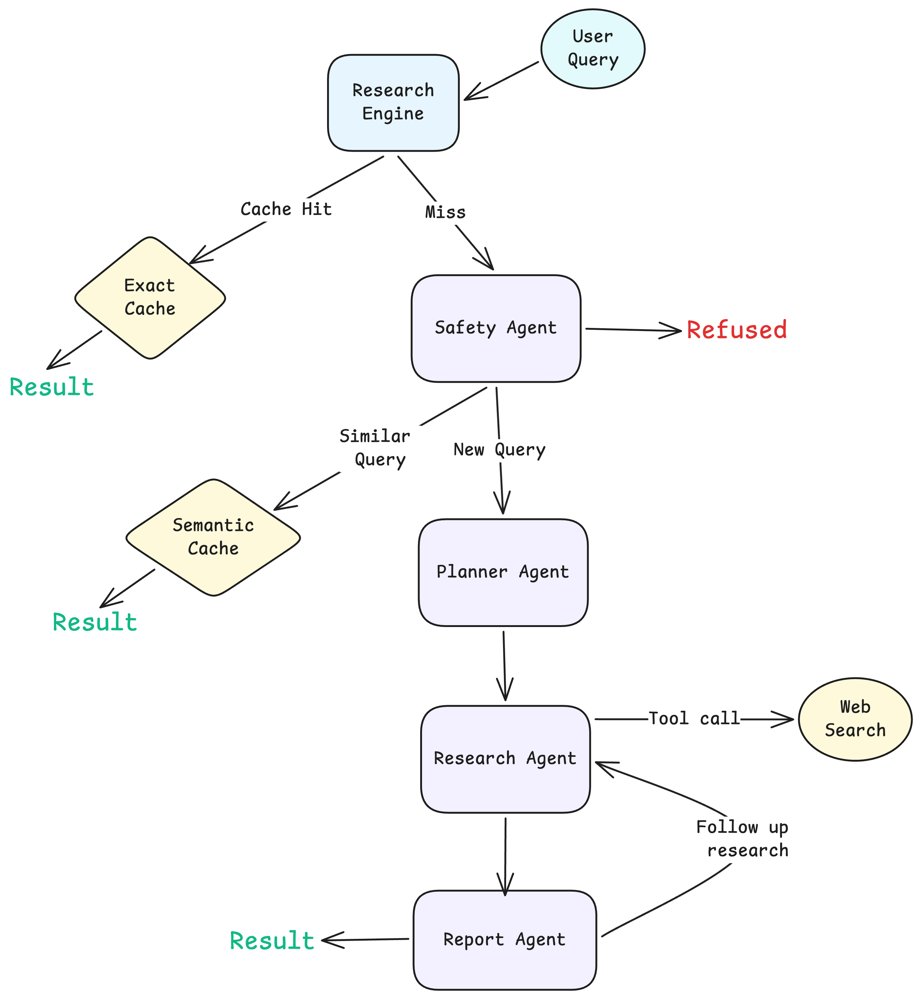

# Multi agent orchestration for research and report

A multi-agent AI research orchestration system that collaborates across specialized agents to safely generate structured research reports from user queries.

## Architecture




## Setup

#### Clone the repo:

```
git clone https://github.com/Lakshyasaharan5/multi-agent-research-engine.git
cd multi-agent-research-engine
```

#### Create environment file

```
vi .env
# use .env.example and fill in your api keys
```

#### Run with Docker Compose

```
docker compose up --build
```

Server will run on: `http://localhost:3000`


#### Test API:

```
curl -X POST http://localhost:3000/api/research \
  -H "Content-Type: application/json" \
  -d '{"query":"How can I learn AI Agent programming using Vercel AI SDK?"}' \
  --output research-output.zip
```

#### Response

**Note:** Please note that the whole report generation will take around 1 minute time.

The API returns a downloadable `.zip` archive containing:

- **logs.txt**: detailed execution logs including orchestration flow, LLM metrics, retries and failures
- **state.json**: final shared memory state snapshot after the pipeline completes
- **report.md**: generated research report with findings, citations and limitations
